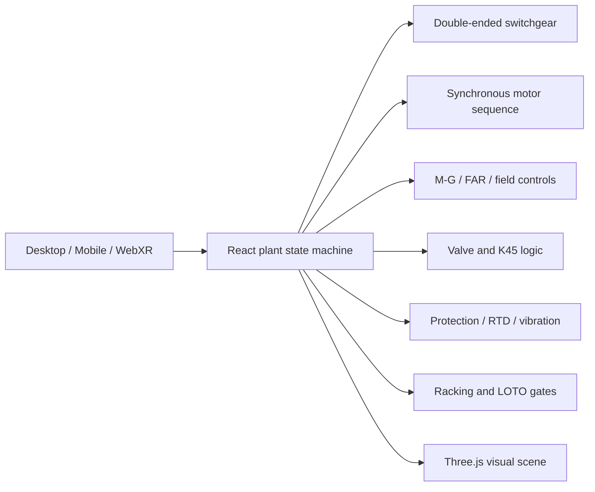

# PowerTrain XR

### Industrial Motor Training Digital Twin

PowerTrain XR is a browser-based, WebXR-ready training simulator for medium-voltage synchronous motor systems. It gives electricians, operators, and technical learners a safe place to practice switching, motor starting, excitation, protective relaying, remote breaker racking, fault response, and lockout/tagout without touching energized equipment.

**Live demo:** https://synchronous-pump-trainer.nayteward.chatgpt.site

## Why it exists

Critical industrial facilities often depend on equipment that is decades old. The people who understand that equipment best may have learned it through years of field experience, old drawings, and troubleshooting under pressure. That knowledge is difficult to transfer through a conventional slide deck or static procedure.

PowerTrain XR turns that knowledge into an interactive system. A learner can operate equipment, make a mistake, see the consequence, read the protection target, correct the cause, and follow the recovery or isolation process.

The project was directed by Naythan Ward, a journeyman electrician and electrical-maintenance leader with 28 years of field experience across healthcare and public water infrastructure.

## What judges can try

1. Open the [3D motor floor](https://synchronous-pump-trainer.nayteward.chatgpt.site/motor-floor-vr).
2. Open **Breakers / RRS-1** and select `52-A1`.
3. Trip the breaker, complete the remote-racking checks, and rack it from `CONNECTED` to `TEST` to `DISCONNECTED`.
4. Apply the simulated yellow isolation lock, hasp, and danger tag.
5. Attempt to close the breaker or run an automatic transfer and observe the enforced interlock.
6. View the breaker-specific SOP, then run the complete group LOTO exercise.
7. Restore the breaker and start the synchronous motor from the DCS or field cabinet.
8. Watch the M contactor, M-G set, 56/FAR, 41 field contactor, field-discharge resistor, 45-second valve seal-in, and 30% valve permissive sequence.
9. Use the training inputs to raise a bearing to its alarm/trip threshold or motor/pump vibration to `0.20 in/s RMS`, then clear the cause and reset the motor relay.

## Major simulated systems

- Eaton VCP-W-style double-ended 4.8 kV lineup
- Eight two-high feeder breakers on each bus
- Main 1–Tie–Main 2 automatic close-transition controls
- CBS ArcSafe RRS-1-style remote racking workflow
- Breaker positions: `CONNECTED`, `TEST`, and `DISCONNECTED`
- Breaker-specific local control, LOTO hardware, and SOP popups
- Single-speed 2,500 hp brushed synchronous motor
- Visible rotor slip rings, carbon brushes, shaft, pump, and 36-inch valve
- Motor-generator excitation set and field-discharge resistor
- Motor protection relay with metering, targets, events, RTDs, and vibration
- Five bearing temperatures: 75°C alarm and 85°C latched trip
- Motor and pump vibration: 0.20 in/s RMS latched trip
- DCS, field-cabinet, and starter control authority
- Fault injection, sound, animated equipment, desktop controls, and WebXR
- Community/group LOTO exercise with locks, hasps, tags, lockbox, verification, and restoration gates

## How Codex and GPT-5.6 were used

The project began with domain knowledge, a legacy control drawing, and a sequence described conversationally by an experienced electrician. GPT-5.6 and Codex accelerated the conversion of that information into a working product by:

- translating iterative operator feedback into explicit state-machine behavior;
- building and revising the Three.js/WebXR equipment room;
- implementing breaker, transfer, motor, excitation, valve, protection, fault, and LOTO interlocks;
- restructuring the switchgear into a complete double-ended lineup;
- creating responsive operator interfaces and equipment-specific training dialogs;
- catching conflicts between controls, trip resets, transfer logic, and lockout state;
- validating, packaging, and publishing the application through Codex Sites.

Human technical judgment remained central. Ratings, labels, sequence decisions, field-device relationships, failure modes, and corrections came from the domain expert. Codex made that expertise executable and rapidly iterable.

## Architecture



## Technology

- GPT-5.6 and Codex
- React 19 and TypeScript
- Three.js and WebXR
- Vinext/Vite
- OpenAI Codex Sites
- Web Audio API
- Responsive HTML/CSS operator interfaces

## Run locally

### Prerequisites

- Node.js `22.13.0` or newer
- npm
- A modern browser with WebGL; WebXR-compatible browser/headset for VR

### Setup

```bash
npm ci
npm run dev
```

Open the local URL printed by Vite, then select `/motor-floor-vr` for the 3D simulator.

### Smartphone and home-screen use

Open `/motor-floor-vr` in Safari on iPhone or Chrome on Android. The mobile layout provides a touch movement pad, a collapsible full control board, and quick access to breaker racking, the motor relay, LOTO, and sound. Rotate to landscape for the widest motor-floor view.

Use **Walk mode** to hide the control board, header, inspection card, and other overlays for an unobstructed equipment-room view. The touch movement pad remains available, and **Show controls** restores the complete interface instantly.

To install it like an app, use **Share → Add to Home Screen** on iPhone or **Browser menu → Add to Home screen / Install app** on Android. The installed shortcut opens directly to the motor floor; no account or app-store download is required.

### Validation

```bash
npm run lint
npm test
```

No account, sample dataset, API key, or external service is required to run the simulator.

## Safety and scope

This is a manufacturer-referenced but non-as-built training representation. It is not a switching order, relay-settings source, energized-work authorization, or replacement for equipment manuals, an arc-flash study, a qualified-person program, or an approved facility-specific LOTO procedure.

## License

The source code is available under the [MIT License](LICENSE). Equipment and manufacturer names are used descriptively for a non-as-built training prototype; no manufacturer endorsement is implied.

## Current status and next steps

PowerTrain XR is a functional public prototype. The next stage is a configurable platform that can ingest equipment photographs, drawings, approved procedures, and site-specific sequences to create private training twins for water, wastewater, healthcare, manufacturing, and data-center facilities. Planned additions include guided scenarios, learner scoring, instructor mode, event review, and multi-user sessions.

## Creator

**Naythan Ward**
Journeyman electrician · Electrical maintenance leader · Industrial training concept and technical direction
